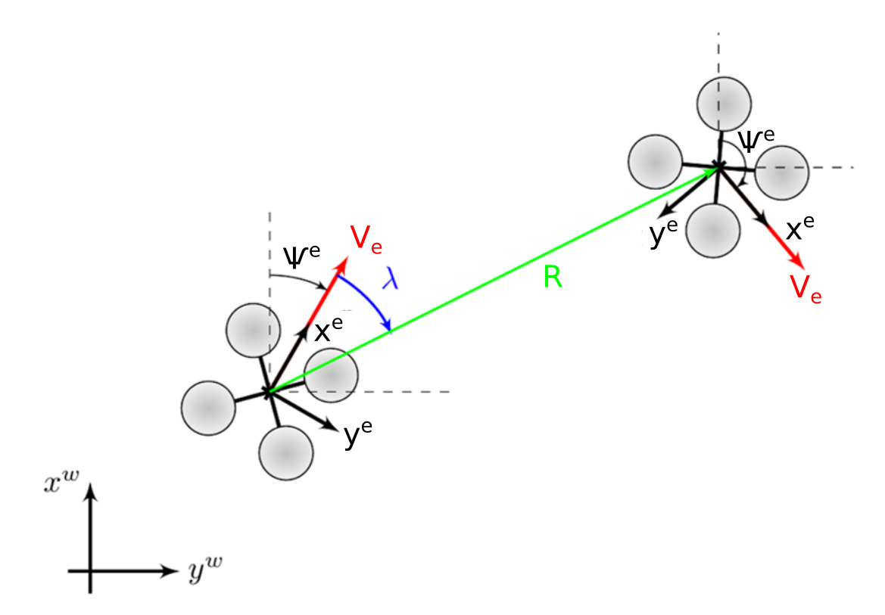

# Proportional Navigation
 [](https://badge.fury.io/py/proportional-navigation)  [](https://coveralls.io/github/iwishiwasaneagle/proportional_navigation?branch=master) [](https://pepy.tech/project/proportional-navigation)

A package to easily do [proportional navigation](https://en.wikipedia.org/wiki/Proportional_navigation). This navigation equation is popular for target-persuader Line-of-Sight applications, such as missiles. The popularity stems partially from it's simple implementation, and effectiveness.

## Explanation on notation

From the below figure, it is clear that we are using velocity/heading model for each body. Such that V is the magnitude of velocity, psi is heading relative to world x-axis, and x and y of the body is relative to the world axes.



## Installation

```bash
git clone https://github.com/iwishiwasaneagle/proportional_navigation
cd proportional_navigation
python setup.py install
```
```bash
pip install proportional_navigation
```
